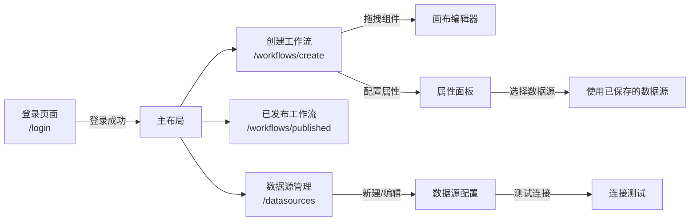
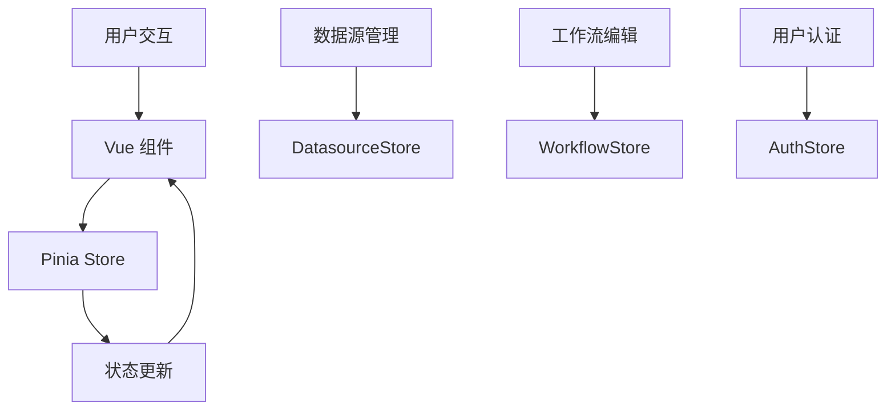

# Workline - 企业级工作流引擎

一个基于 Vue 3 + TypeScript + Vite 构建的现代化企业级工作流编排工具。

```
╔═══════════════════════════════════════════════════════════════════╗
║                    ██╗    ██╗ ██████╗ ██████╗ ██╗  ██╗██╗███╗   ██╗███████╗                    ║
║                    ██║    ██║██╔═══██╗██╔══██╗██║ ██╔╝██║████╗  ██║██╔════╝                    ║
║                    ██║ █╗ ██║██║   ██║██████╔╝█████╔╝ ██║██╔██╗ ██║█████╗                      ║
║                    ██║███╗██║██║   ██║██╔══██╗██╔═██╗ ██║██║╚██╗██║██╔══╝                      ║
║                    ╚███╔███╔╝╚██████╔╝██║  ██║██║  ██╗██║██║ ╚████║███████╗                    ║
║                     ╚══╝╚══╝  ╚═════╝ ╚═╝  ╚═╝╚═╝  ╚═╝╚═╝╚═╝  ╚═══╝╚══════╝                    ║
╚═══════════════════════════════════════════════════════════════════╝
```

## 📸 界面截图

| 登录页面 | 创建工作流 |
|:--------:|:----------:|
|  |  |

| 已发布工作流 | 数据源管理 |
|:------------:|:----------:|
|  |  |

> 💡 **如何添加截图**: 将截图保存到 `screenshots/` 目录，然后更新上面的图片路径即可。

---

## 目录

- [技术栈](#技术栈)
- [功能特性](#功能特性)
- [页面导航](#页面导航)
- [组件库](#组件库)
- [快速开始](#快速开始)
- [项目架构](#项目架构)

## 技术栈

```
┌─────────────────────────────────────────────────────────────────────┐
│  Vue 3 (Composition API)  │  TypeScript  │  Vite                  │
├─────────────────────────────────────────────────────────────────────┤
│  Pinia (状态管理)         │  Vue Router  │  Lucide Icons          │
└─────────────────────────────────────────────────────────────────────┘
```

- **框架**: Vue 3 (Composition API)
- **语言**: TypeScript
- **构建工具**: Vite
- **状态管理**: Pinia
- **路由**: Vue Router
- **图标**: Lucide Vue Next

## 功能特性

### 整体架构

```mermaid
graph TB
    A[用户访问] --> B{登录验证}
    B -->|未登录| C[登录页面 /login]
    B -->|已登录| D[主布局 MainLayout]

    D --> E[左侧导航栏]
    D --> F[内容区域]

    E --> E1[创建工作流]
    E --> E2[已发布工作流]
    E --> E3[数据源管理]

    F --> F1[/workflows/create]
    F --> F2[/workflows/published]
    F --> F3[/datasources]
```

---

### 1. 登录页面 (`/login`)

```
┌─────────────────────────────────────────────────────────┐
│                                                           │
│   ┌─────────────────────────────────────────────────┐   │
│   │  Workline Logo                                  │   │
│   │                                                 │   │
│   │  ┌─────────────────────────────────────────┐  │   │
│   │  │  用户名: [_________________]            │  │   │
│   │  │  密码:   [_________________]            │  │   │
│   │  │                                         │  │   │
│   │  │  [ 登 录 ]                              │  │   │
│   │  └─────────────────────────────────────────┘  │   │
│   │                                                 │   │
│   │  预设用户: admin / user / demo                  │   │
│   └─────────────────────────────────────────────────┘   │
│                                                           │
└─────────────────────────────────────────────────────────┘
```

**功能介绍**:
- 用户登录界面
- 支持多用户登录 (admin/user/demo)
- 美观的渐变设计风格
- 自动重定向已登录用户

**样式特点**:
- 现代渐变背景 (蓝紫渐变)
- 卡片式登录表单
- 平滑的动画效果
- 响应式设计

---

### 2. 主布局

```
┌───────────────────────────────────────────────────────────────────────┐
│  ┌────────────┐ ┌──────────────────────────────────────────────────┐ │
│  │  Workline  │ │                                                  │ │
│  │            │ │          内容区域 (router-view)                  │ │
│  │ [组织切换] │ │                                                  │ │
│  │            │ │  /workflows/create                               │ │
│  │  📝 创建   │ │  /workflows/published                            │ │
│  │  📋 已发布 │ │  /datasources                                    │ │
│  │  🗄️ 数据源 │ │                                                  │ │
│  │            │ │                                                  │ │
│  │            │ │                                                  │ │
│  │  ┌──────┐  │ │                                                  │ │
│  │  │ User │  │ │                                                  │ │
│  │  └──────┘  │ │                                                  │ │
│  └────────────┘ └──────────────────────────────────────────────────┘ │
└───────────────────────────────────────────────────────────────────────┘
```

**功能介绍**:
- 左侧侧边栏导航
- 组织切换器 (支持多组织)
- 用户信息展示
- 统一的页面框架

**样式特点**:
- 简洁的白色侧边栏 (260px)
- 渐变色 Logo (蓝紫渐变)
- 响应式布局设计
- 激活状态高亮显示

---

### 3. 创建工作流 (`/workflows/create`)

```
┌───────────────────────────────────────────────────────────────────────┐
│  ┌──────────┐ ┌───────────────────────────┐ ┌──────────────────┐ │
│  │ 组件库   │ │                           │ │   属性配置       │ │
│  │          │ │      Canvas 画布          │ │                  │ │
│  │  ⚡ 触发 │ │    ┌─────────────────┐   │ │  名称: [____]   │ │
│  │  🖱️ 操作 │ │    │  🟡 Trigger   │   │ │  描述: [____]   │ │
│  │  🌿 条件 │ │    └────────┬────────┘   │ │                  │ │
│  │  ↔️ 转换 │ │             │            │ │  [数据源选择]    │ │
│  │  🌐 API  │ │    ┌────────▼────────┐   │ │  [SQL查询]      │ │
│  │  🗄️ 数据 │ │    │  🟢 Database  │   │ │                  │ │
│  │  🔔 通知 │ │    └────────┬────────┘   │ │                  │ │
│  │  ✅ 输出 │ │             │            │ │                  │ │
│  │          │ │    ┌────────▼────────┐   │ │                  │ │
│  │          │ │    │  🔵 Output    │   │ │                  │ │
│  │          │ │    └─────────────────┘   │ │                  │ │
│  └──────────┘ └───────────────────────────┘ └──────────────────┘ │
└───────────────────────────────────────────────────────────────────────┘
```

**功能介绍**:
- 可视化画布编辑器
- 拖拽式节点放置
- 节点连线管理
- 组件属性配置面板
- 支持数据库节点选择已保存的数据源

**样式特点**:
- 网格背景画布
- 彩色节点区分 (8种颜色)
- 流畅的拖拽交互
- 左右双面板布局

---

### 4. 已发布工作流 (`/workflows/published`)

```
┌───────────────────────────────────────────────────────────────────────┐
│  已发布工作流                                                          │
│                                                                       │
│  ┌──────────────┐  ┌──────────────┐  ┌──────────────┐            │
│  │ 工作流A      │  │ 工作流B      │  │ 工作流C      │            │
│  │              │  │              │  │              │            │
│  │ [🟢 运行中] │  │ [🔴 已停止] │  │ [🟡 等待中] │            │
│  │              │  │              │  │              │            │
│  │ 上次运行:    │  │ 上次运行:    │  │ 上次运行:    │            │
│  │  2分钟前     │  │  1小时前     │  │  昨天        │            │
│  │              │  │              │  │              │            │
│  │ [▶️ 启动]    │  │ [▶️ 启动]    │  │ [▶️ 启动]    │            │
│  │ [📊 历史]    │  │ [📊 历史]    │  │ [📊 历史]    │            │
│  └──────────────┘  └──────────────┘  └──────────────┘            │
│                                                                       │
└───────────────────────────────────────────────────────────────────────┘
```

**功能介绍**:
- 已发布工作流列表 (网格布局)
- 运行状态展示 (运行中/已停止/等待中)
- 执行历史查看
- 启动/停止操作

**样式特点**:
- 卡片网格布局 (自适应列数)
- 状态徽章标识 (颜色区分)
- 时间线展示执行历史
- 悬停卡片效果

---

### 5. 数据源管理 (`/datasources`)

```
┌───────────────────────────────────────────────────────────────────────┐
│  数据源管理                                [ + 新建数据源 ]            │
│                                                                       │
│  ┌──────────────────┐  ┌──────────────────┐  ┌──────────────────┐ │
│  │ 🟦 MySQL         │  │ 🟫 PostgreSQL    │  │ 🔴 Redis         │ │
│  │ 生产数据库       │  │ 测试环境         │  │ 会话缓存         │ │
│  │                  │  │                  │  │                  │ │
│  │ 192.168.1.100   │  │ localhost:5432   │  │ 192.168.1.101   │ │
│  │ 创建于 7天前     │  │ 创建于 2天前     │  │ 创建于 5天前     │ │
│  │                  │  │                  │  │                  │ │
│  │ [⚡测试] [✏️编辑]│  │ [⚡测试] [✏️编辑]│  │ [⚡测试] [✏️编辑]│ │
│  └──────────────────┘  └──────────────────┘  └──────────────────┘ │
│                                                                       │
│  新建数据源弹窗:                                                      │
│  ┌─────────────────────────────────────────────────────────────┐   │
│  │  选择数据源类型:                                              │   │
│  │  ┌──────┐ ┌──────┐ ┌──────┐ ┌──────┐ ┌──────┐          │   │
│  │  │MySQL │ │PgSQL │ │Mongo │ │Redis │ │Elastic│ ...      │   │
│  │  └──────┘ └──────┘ └──────┘ └──────┘ └──────┘          │   │
│  │                                                             │   │
│  │  数据源名称: [_______________]                             │   │
│  │  描述:      [_______________]                             │   │
│  │                                                             │   │
│  │  连接配置:                                                 │   │
│  │  主机: [localhost]     端口: [3306]                      │   │
│  │  数据库: [mydb]       用户: [root]                        │   │
│  │  密码: [******]                                            │   │
│  │                                                             │   │
│  │  [ ☑ 共享给组织成员 ]                                      │   │
│  │                                                             │   │
│  │                  [ 取消 ]  [ 创建 ]                        │   │
│  └─────────────────────────────────────────────────────────────┘   │
└───────────────────────────────────────────────────────────────────────┘
```

**功能介绍**:
- 8种数据源类型支持:
  - 🟦 MySQL
  - 🟫 PostgreSQL
  - 🟢 MongoDB
  - 🔴 Redis
  - 🟦 Elasticsearch
  - 🔵 HTTP API
  - 🔴 Oracle
  - 🔴 SQL Server
- 数据源配置表单
- 连接测试功能
- 数据源编辑/删除
- 共享给组织成员选项

**样式特点**:
- 彩色类型选择器 (每种数据源有专属颜色)
- 卡片式列表展示
- 模态框表单设计
- 测试连接实时反馈

---

## 页面导航



## 组件库

### 节点类型总览

```
┌─────────────────────────────────────────────────────────────────────┐
│                        组件库 (8个节点)                              │
├─────────────────────────────────────────────────────────────────────┤
│                                                                      │
│  【开始类】                                                          │
│  ┌─────────────────────────────────────────────────────────────┐  │
│  │ ⚡ 触发器 (Trigger)  - 工作流的起始点                      │  │
│  │    参数: event                                               │  │
│  │    输入: []  输出: ['output']                               │  │
│  └─────────────────────────────────────────────────────────────┘  │
│                                                                      │
│  【处理类】                                                          │
│  ┌─────────────────────────────────────────────────────────────┐  │
│  │ 🖱️ 操作 (Action)     - 执行特定操作                        │  │
│  │ 🌿 条件判断 (Condition) - 根据条件分支                      │  │
│  │ ↔️ 数据转换 (Transform) - 转换数据格式                      │  │
│  │ 🌐 API请求 (API)      - 调用外部API                        │  │
│  │ 🗄️ 数据库 (Database)   - 数据库操作 (可选择数据源)        │  │
│  └─────────────────────────────────────────────────────────────┘  │
│                                                                      │
│  【结束类】                                                          │
│  ┌─────────────────────────────────────────────────────────────┐  │
│  │ 🔔 通知 (Notification) - 发送通知消息                      │  │
│  │ ✅ 输出 (Output)       - 工作流结束                          │  │
│  └─────────────────────────────────────────────────────────────┘  │
│                                                                      │
└─────────────────────────────────────────────────────────────────────┘
```

### 组件网格布局

```
┌─────────────────────────────────────────────────┐
│  开始类                                          │
│  ┌──────────────┐                                │
│  │    ⚡        │                                │
│  │   触发器     │                                │
│  └──────────────┘                                │
│                                                  │
│  处理类                                          │
│  ┌──────────────┐ ┌──────────────┐             │
│  │    🖱️        │ │    🌿        │             │
│  │    操作      │ │  条件判断    │             │
│  └──────────────┘ └──────────────┘             │
│  ┌──────────────┐ ┌──────────────┐             │
│  │    ↔️        │ │    🌐        │             │
│  │  数据转换    │ │  API请求     │             │
│  └──────────────┘ └──────────────┘             │
│  ┌──────────────┐                                │
│  │    🗄️        │                                │
│  │   数据库     │                                │
│  └──────────────┘                                │
│                                                  │
│  结束类                                          │
│  ┌──────────────┐ ┌──────────────┐             │
│  │    🔔        │ │    ✅        │             │
│  │    通知      │ │    输出      │             │
│  └──────────────┘ └──────────────┘             │
└─────────────────────────────────────────────────┘
```

### 开始类节点

| 图标 | 名称 | 类型 | 描述 | 输入 | 输出 |
|------|------|------|------|------|------|
| ⚡ | 触发器 | trigger | 工作流的起始点 | [] | ['output'] |

### 处理类节点

| 图标 | 名称 | 类型 | 描述 | 输入 | 输出 |
|------|------|------|------|------|------|
| 🖱️ | 操作 | action | 执行特定操作 | ['input'] | ['output'] |
| 🌿 | 条件判断 | condition | 根据条件分支 | ['input'] | ['true', 'false'] |
| ↔️ | 数据转换 | transform | 转换数据格式 | ['input'] | ['output'] |
| 🌐 | API请求 | api | 调用外部API | ['input'] | ['success', 'error'] |
| 🗄️ | 数据库 | database | 数据库操作 (支持选择已保存的数据源) | ['input'] | ['output'] |

### 结束类节点

| 图标 | 名称 | 类型 | 描述 | 输入 | 输出 |
|------|------|------|------|------|------|
| 🔔 | 通知 | notification | 发送通知消息 | ['input'] | ['output'] |
| ✅ | 输出 | output | 工作流结束 | ['input'] | [] |

---

## 快速开始

```bash
# 安装依赖
npm install

# 启动开发服务器
npm run dev
# 访问 http://localhost:5173

# 构建生产版本
npm run build
```

### 默认登录用户

| 用户名 | 密码 | 说明 |
|--------|------|------|
| admin | admin123 | 管理员 |
| user | user123 | 普通用户 |
| demo | demo123 | 演示用户 |

---

## 项目架构

### 目录结构

```
src/
├── components/
│   ├── auth/
│   │   └── Login.vue              # 登录页面
│   ├── canvas/
│   │   └── CanvasEditor.vue       # 画布编辑器
│   ├── datasource/
│   │   └── DatasourceManager.vue  # 数据源管理
│   ├── layout/
│   │   ├── MainLayout.vue         # 主布局
│   │   ├── NodePanel.vue          # 组件库面板
│   │   └── PropertiesPanel.vue    # 属性配置面板
│   ├── node/
│   │   └── NodeItem.vue           # 节点组件
│   └── workflow/
│       ├── CreateWorkflow.vue     # 创建工作流页面
│       └── PublishedWorkflows.vue # 已发布工作流页面
├── config/
│   ├── nodeLibrary.ts             # 节点库配置
│   └── datasourceLibrary.ts       # 数据源库配置
├── router/
│   └── index.ts                    # 路由配置
├── stores/
│   ├── auth.ts                     # 认证状态
│   ├── workflows.ts                # 工作流状态
│   └── datasource.ts               # 数据源状态
├── types/
│   ├── index.ts                    # 节点/工作流类型
│   ├── auth.ts                     # 认证类型
│   └── datasource.ts               # 数据源类型
├── App.vue
└── main.ts
```

### 数据流



## License

MIT
